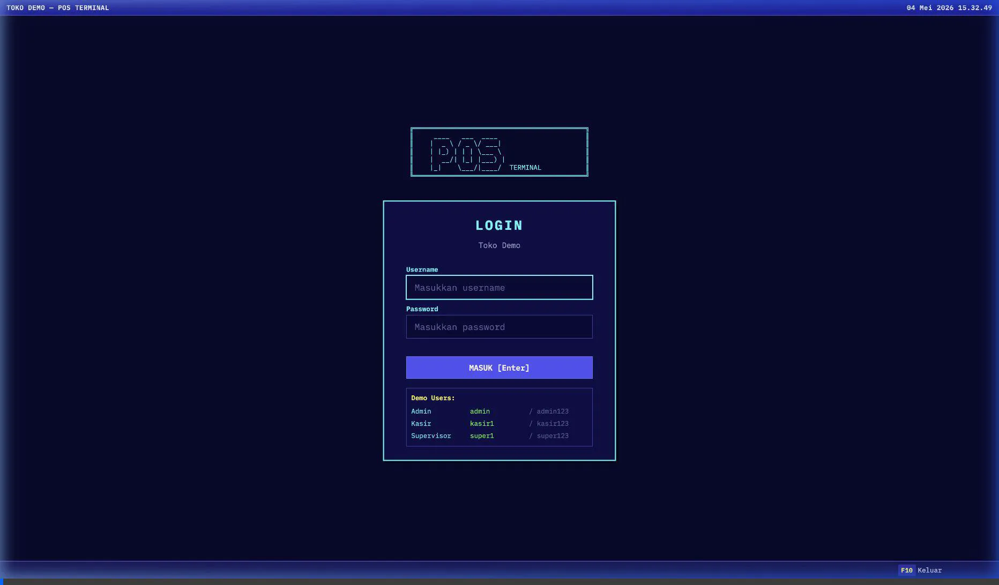
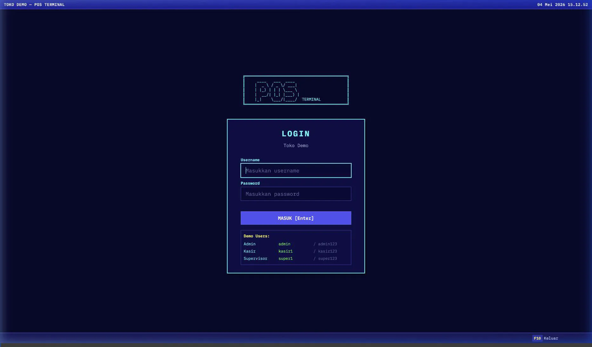
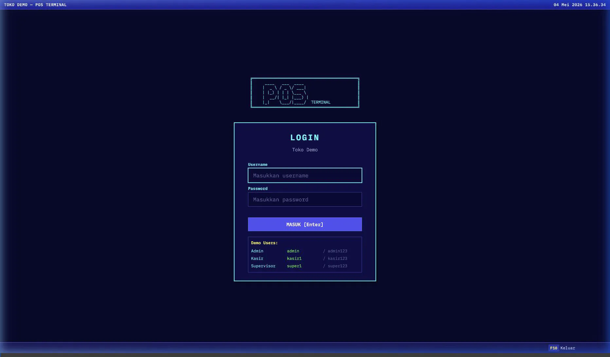

# POS App Workflows

Here are the recorded workflows for the three different user roles using the POS Application. Each role has access to specific menus and features according to their permissions.

## 👑 Admin Workflow
The Admin has full access to all features, including the `Administrasi` menu to manage users.

## 🛒 Kasir Workflow
The Kasir (Cashier) is focused on operations. They can open/close shifts, input petty cash, and perform sales transactions.

## 📋 Supervisor Workflow
The Supervisor can manage products, receive goods, view reports, and perform cashier duties, but cannot manage other users.

